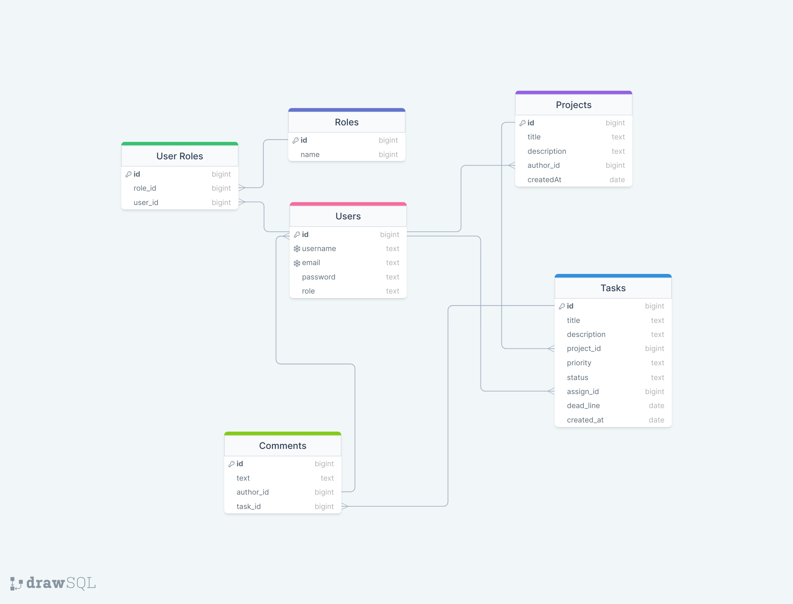

## Description

Simple Auth & Task-management app using Nest, Postgres, Docker.

## What was used

- Docker
- Docker-Compose
- Nest.js
- Postgres
- Websocket
- Jest
- Swagger

## Installation

```bash
$ npm install
```

## Running the app

```bash
# development
$ npm run start

# watch mode
$ npm run start:dev

# production mode
$ npm run start:prod
```

## Test

```bash
# unit tests
$ npm run test

# e2e tests
$ npm run test:e2e

# test coverage
$ npm run test:cov
```

## Database diagram

