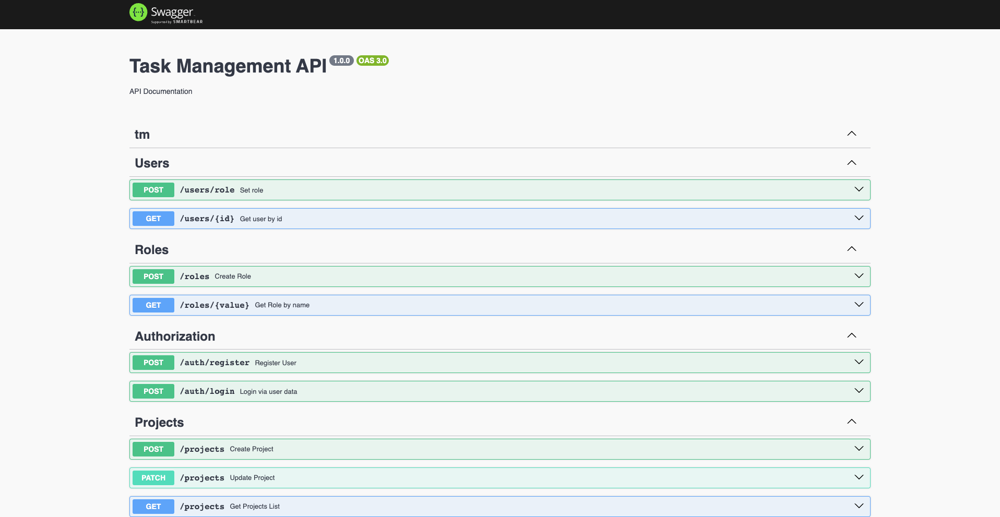

## Description

Simple Auth & Task-management app using Nest, Postgres, Docker.

## What was used

- Docker
- Docker-Compose
- Nest.js
- Postgres
- Websocket
- Jest
- Swagger

## For project launch

```bash
$ docker-compose up -d --build
```

## Api documentation located at /api/docs


## Database diagram

